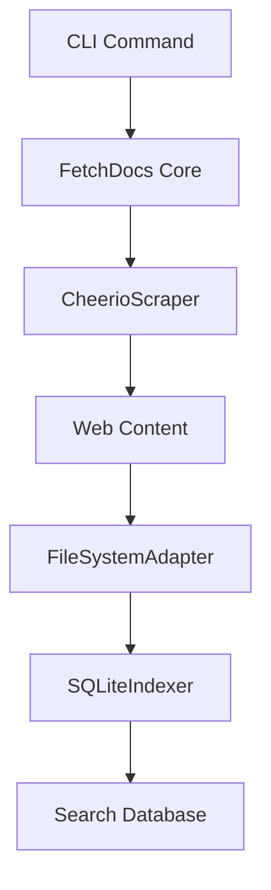
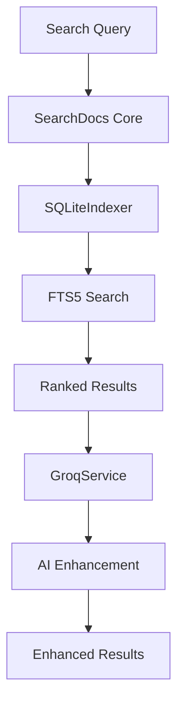
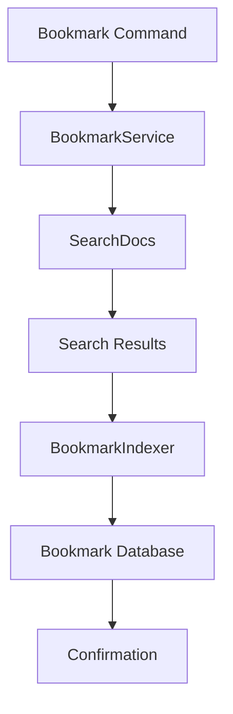

# 🏗️ Architecture Overview

This document provides a comprehensive overview of docu-cli's architecture, focusing on the Clean Architecture principles and the integration of the new bookmark system.

## 🎯 Architecture Principles

docu-cli follows **Clean Architecture** principles to ensure maintainability, testability, and extensibility:

1. **Separation of Concerns**: Each layer has a specific responsibility
2. **Dependency Inversion**: High-level modules don't depend on low-level modules
3. **Testability**: Each component can be tested in isolation
4. **Framework Independence**: Business logic is independent of external frameworks

## 📁 Project Structure

```
docu-cli/
├── bin/
│   └── index.ts                    # CLI entry point
├── src/
│   ├── cli/                        # 🖥️  CLI Interface Layer
│   │   ├── available.ts            # Show available docsets
│   │   ├── bookmark.ts             # Bookmark management commands
│   │   ├── copy.ts                 # Copy code examples
│   │   ├── explain.ts              # AI explanations
│   │   ├── export.ts               # Export search results
│   │   ├── fetch.ts                # Fetch documentation
│   │   ├── interactive.ts          # Interactive search mode
│   │   ├── list.ts                 # List cached docsets
│   │   ├── quick.ts                # Quick reference lookup
│   │   ├── remove.ts               # Remove cached docs
│   │   ├── search.ts               # Search documentation
│   │   ├── setup.ts                # Initial configuration
│   │   ├── tui.ts                  # Terminal UI mode
│   │   └── update.ts               # Update cached docs
│   ├── core/                       # 🧠 Business Logic Layer
│   │   ├── FetchDocs.ts            # Documentation fetching logic
│   │   ├── ListDocs.ts             # Documentation listing logic
│   │   ├── RemoveDocs.ts           # Documentation removal logic
│   │   └── SearchDocs.ts           # Documentation search logic
│   ├── domain/                     # 📋 Domain Models
│   │   ├── Bookmark.ts             # Bookmark entities and interfaces
│   │   ├── Docset.ts               # Documentation set models
│   │   └── Search.ts               # Search-related interfaces
│   ├── infrastructure/             # 🔧 Infrastructure Layer
│   │   ├── indexer/                # Search indexing
│   │   │   ├── BookmarkIndexer.ts  # Bookmark storage and search
│   │   │   └── SQLiteIndexer.ts    # Document indexing with SQLite
│   │   ├── scraper/                # Web scraping
│   │   │   └── CheerioScraper.ts   # HTML parsing and content extraction
│   │   └── storage/                # Data persistence
│   │       └── FileSystemAdapter.ts # File system operations
│   ├── services/                   # 🚀 Application Services
│   │   ├── BookmarkService.ts      # High-level bookmark operations
│   │   └── GroqService.ts          # AI service integration
│   ├── tui/                        # 🎨 Terminal UI Components
│   │   ├── App.tsx                 # Main TUI application
│   │   ├── components/             # Reusable UI components
│   │   │   └── StatusBar.tsx       # Status bar component
│   │   └── screens/                # TUI screens
│   │       ├── DocsetBrowser.tsx   # Browse available docsets
│   │       ├── DocumentViewer.tsx  # View documents
│   │       ├── HelpScreen.tsx      # Help and documentation
│   │       ├── MainDashboard.tsx   # Main dashboard
│   │       ├── SearchScreen.tsx    # Search interface
│   │       └── SettingsScreen.tsx  # Settings management
│   ├── utils/                      # 🛠️ Utility Functions
│   │   ├── Banner.ts               # CLI banner display
│   │   ├── MarkdownPager.ts        # Paginated markdown viewer
│   │   └── SmartFetch.ts           # Intelligent fetching suggestions
│   └── config/
│       └── docsets.json            # Supported documentation sets
├── tests/                          # 🧪 Test Suite
│   ├── bookmark.test.ts            # Bookmark system tests
│   └── core.test.ts                # Core functionality tests
└── docs/                           # 📚 Documentation
    ├── features/                   # Feature documentation
    ├── development/                # Development guides
    ├── api/                        # API reference
    └── examples/                   # Usage examples
```

## 🏛️ Layer Architecture

### 1. CLI Interface Layer (`src/cli/`)

**Responsibility**: Handle user interactions and command parsing

**Components**:

- Command definitions using `commander.js`
- Argument validation and option parsing
- User input/output formatting
- Error handling and user feedback

**Key Features**:

- Type-safe command definitions
- Consistent error handling
- Rich CLI output with colors and icons
- Integration with TUI components

**Example**:

```typescript
// src/cli/bookmark.ts
export const bookmarkCommand = new Command('bookmark')
  .description('Manage your personal documentation bookmarks')
  .addCommand(addCommand)
  .addCommand(listCommand)
  .addCommand(searchCommand);
```

### 2. Business Logic Layer (`src/core/`)

**Responsibility**: Implement core business logic and use cases

**Components**:

- Documentation fetching workflows
- Search algorithms and ranking
- Data processing and transformation
- Business rule enforcement

**Key Features**:

- Framework-independent business logic
- Clear separation of concerns
- Comprehensive error handling
- Optimized for performance

**Example**:

```typescript
// src/core/SearchDocs.ts
export class SearchDocs {
  async search(query: string, options: SearchOptions): Promise<SearchResult[]> {
    // Business logic for searching documents
    return await this.indexer.search(query, options);
  }
}
```

### 3. Domain Models (`src/domain/`)

**Responsibility**: Define core entities and business rules

**Components**:

- Entity interfaces and types
- Business rule definitions
- Data contracts between layers
- Domain-specific enumerations

**Key Features**:

- Type-safe domain modeling
- Clear data contracts
- Business rule encapsulation
- Framework-independent definitions

**Example**:

```typescript
// src/domain/Bookmark.ts
export interface Bookmark {
  id: string;
  title: string;
  content: string;
  docset: string;
  tags: string[];
  importance: 'low' | 'medium' | 'high';
  createdAt: Date;
  updatedAt: Date;
}
```

### 4. Infrastructure Layer (`src/infrastructure/`)

**Responsibility**: Handle external dependencies and data persistence

**Components**:

- Database operations (SQLite)
- File system interactions
- Web scraping and HTTP requests
- Search indexing and retrieval

**Key Features**:

- Dependency injection ready
- Abstracted external dependencies
- Optimized for performance
- Error handling and retry logic

**Example**:

```typescript
// src/infrastructure/indexer/BookmarkIndexer.ts
export class BookmarkIndexer {
  async addBookmark(bookmark: Bookmark): Promise<string> {
    // SQLite operations for bookmark storage
    return await this.db.insert(bookmark);
  }
}
```

### 5. Application Services (`src/services/`)

**Responsibility**: Coordinate between core logic and infrastructure

**Components**:

- High-level application workflows
- Cross-cutting concerns (logging, caching)
- External service integrations
- Complex business process orchestration

**Key Features**:

- Stateless service design
- Dependency injection
- Comprehensive error handling
- Performance optimization

**Example**:

```typescript
// src/services/BookmarkService.ts
export class BookmarkService {
  async addBookmarkFromSearchResult(result: SearchResult): Promise<string> {
    // Orchestrate bookmark creation from search results
    const bookmark = this.mapSearchResultToBookmark(result);
    return await this.indexer.addBookmark(bookmark);
  }
}
```

## 🔄 Data Flow

### Documentation Fetching Flow



1. **CLI Layer**: User runs `docu fetch react`
2. **Core Layer**: `FetchDocs` orchestrates the fetching process
3. **Infrastructure**: `CheerioScraper` extracts content from web pages
4. **Storage**: `FileSystemAdapter` saves raw content to disk
5. **Indexing**: `SQLiteIndexer` creates searchable index

### Search Flow



1. **Input**: User provides search query
2. **Core Logic**: `SearchDocs` processes the query
3. **Infrastructure**: `SQLiteIndexer` performs FTS5 search
4. **Ranking**: Results ranked by relevance score
5. **AI Enhancement**: Optional AI insights from `GroqService`
6. **Output**: Formatted results with AI enhancements

### Bookmark Flow



1. **Command**: User runs `docu bookmark add "query"`
2. **Service**: `BookmarkService` coordinates the process
3. **Search**: `SearchDocs` finds relevant documentation
4. **Storage**: `BookmarkIndexer` saves bookmark to database
5. **Feedback**: User receives confirmation

## 🔌 Dependency Management

### Dependency Injection Pattern

```typescript
// Core classes accept dependencies through constructor
export class BookmarkService {
  constructor(
    private readonly indexer: BookmarkIndexer = new BookmarkIndexer(),
    private readonly searcher: SearchDocs = new SearchDocs()
  ) {}
}

// CLI commands create and inject dependencies
const bookmarkService = new BookmarkService();
const result = await bookmarkService.addBookmark(data);
```

### Interface Segregation

```typescript
// Domain interfaces define contracts
interface BookmarkRepository {
  add(bookmark: Bookmark): Promise<string>;
  find(id: string): Promise<Bookmark | null>;
  search(options: SearchOptions): Promise<Bookmark[]>;
}

// Infrastructure implements interfaces
export class BookmarkIndexer implements BookmarkRepository {
  // SQLite-specific implementation
}
```

## 🔄 State Management

### Stateless Design

- All services are stateless by design
- State is managed at the CLI command level
- Database serves as the single source of truth
- No global state or singletons

### Data Persistence Strategy

```typescript
// Configuration and caching
~/.docu/
├── index/
│   ├── bookmarks.db        # Bookmark database
│   ├── react.db            # React documentation index
│   └── javascript.db       # JavaScript documentation index
├── react/
│   ├── metadata.json       # Docset metadata
│   └── docs/               # Raw documentation files
└── .env                    # User configuration
```

## 🧪 Testing Architecture

### Test Strategy

- **Unit Tests**: Test individual components in isolation
- **Integration Tests**: Test component interactions
- **CLI Tests**: Test command-line interface behavior
- **Performance Tests**: Validate performance requirements

### Test Structure

```typescript
// tests/bookmark.test.ts
describe('Bookmark System', () => {
  let service: BookmarkService;

  beforeEach(() => {
    service = new BookmarkService();
  });

  test('should add bookmark with metadata', async () => {
    // Test implementation
  });
});
```

## 🚀 Performance Considerations

### Search Performance

- **SQLite FTS5**: Full-text search with BM25 ranking
- **Indexing Strategy**: Optimized for read performance
- **Caching**: In-memory caching for frequently accessed data
- **Pagination**: Limit result sets for large collections

### Memory Management

- **Streaming**: Large files processed in streams
- **Connection Pooling**: Database connections managed efficiently
- **Garbage Collection**: Proper resource cleanup in all layers

### Scalability

- **Horizontal Scaling**: Stateless services support scaling
- **Data Partitioning**: Documents indexed by docset
- **Asynchronous Processing**: Non-blocking I/O operations

## 🔧 Configuration Management

### Environment Configuration

```typescript
// src/services/GroqService.ts
export class GroqService {
  static fromEnv(): GroqService {
    const config = {
      apiKey: process.env.GROQ_API_KEY,
      model: process.env.GROQ_MODEL || 'llama3-8b-8192',
      maxTokens: parseInt(process.env.GROQ_MAX_TOKENS || '1024'),
    };
    return new GroqService(config);
  }
}
```

### Docset Configuration

```json
// src/config/docsets.json
[
  {
    "name": "react",
    "description": "React Documentation",
    "baseUrl": "https://react.dev",
    "scrapeRules": {
      "entryPoints": ["https://react.dev/learn"],
      "selectors": {
        "title": "h1, h2, h3",
        "content": "main, article"
      }
    }
  }
]
```

## 🔐 Security Considerations

### Input Validation

- All user inputs validated at CLI layer
- SQL injection prevention through parameterized queries
- Path traversal protection in file operations

### Data Privacy

- All data stored locally on user's machine
- No telemetry or data collection by default
- API keys stored in local environment files

### Error Handling

- Sensitive information not exposed in error messages
- Graceful degradation for external service failures
- Comprehensive logging for debugging

## 🚀 Future Architecture Enhancements

### Microservices Transition

- Service-oriented architecture ready
- API gateway for external integrations
- Independent service deployment

### Plugin Architecture

- Plugin interface for custom docsets
- Custom scraper implementations
- Third-party service integrations

### Cloud Integration

- Optional cloud backup for bookmarks
- Team collaboration features
- Distributed caching layer

---

**Related Documentation:**

- [Testing Guide](./testing.md)
- [API Reference](./api-reference.md)
- [Contributing Guidelines](./contributing.md)
- [Performance Optimization](./performance.md)
